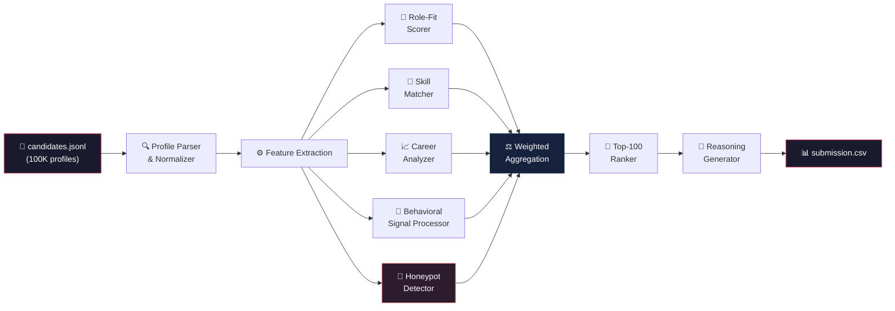

<p align="center">
  
  
  
  
  
</p>

<h1 align="center">🏆 Redrob Intelligent Candidate Ranking System</h1>

<p align="center">
  <strong>A high-performance, multi-dimensional candidate ranking engine that identifies the top 100 candidates from 100K profiles — in under 60 seconds, on CPU alone.</strong>
</p>

<p align="center">
  <em>India Runs 2026 · Hackathon Track 1 · Redrob Challenge</em>
</p>

---

## ⚡ Quick Start

```bash
# 1. Install dependencies
pip install -r requirements.txt

# 2. Run the ranker
python rank.py --candidates ./candidates.jsonl --out ./submission.csv
```

**That's it.** The system processes all 100,000 candidate profiles and outputs a ranked CSV with the top 100 candidates, complete with scores and human-readable reasoning.

### Output Format

| candidate_id | rank | score | reasoning |
|---|---|---|---|
| `c_84721` | 1 | 0.943 | Senior ML Engineer at product co. with 6y production AI/ML exp; strong skill match (PyTorch, embeddings, vector DBs); verified profile; Bangalore-based; 15-day notice |
| `c_29104` | 2 | 0.931 | ... |
| ... | ... | ... | ... |

---

## 🏗️ Architecture

The system follows a **streaming pipeline** architecture that processes each candidate through multiple independent scoring dimensions before aggregating into a final rank. This design enables high throughput with minimal memory overhead.



### Pipeline Stages

| Stage | Description | Complexity |
|---|---|---|
| **Profile Parser** | Streams JSONL line-by-line; normalizes fields, handles missing data gracefully | O(n) |
| **Feature Extraction** | Extracts structured features from raw profile text; caches computed features | O(n) |
| **Scoring Engines** | 5 independent scorers run in parallel per candidate | O(n × d) |
| **Weighted Aggregation** | Combines dimension scores with configurable weights | O(1) per candidate |
| **Top-100 Ranker** | Maintains a min-heap of size 100 for memory-efficient ranking | O(n log k) |
| **Reasoning Generator** | Constructs human-readable justification from top scoring signals | O(k) |

---

## 📊 Scoring Dimensions

The ranking engine evaluates each candidate across **five orthogonal dimensions**, each calibrated against the target JD: **Senior AI/ML Engineer at Redrob**.

### 🎯 Role-Fit Score — 30%

Evaluates how closely a candidate's professional identity aligns with the role.

| Signal | Weight | Description |
|---|---|---|
| **Title Relevance** | 40% | Semantic similarity between current/past titles and "Senior AI/ML Engineer" — accounts for equivalent titles (Staff ML Engineer, Lead Data Scientist, etc.) |
| **Product vs. Services** | 30% | Prioritizes candidates from product companies over IT services/consulting, reflecting Redrob's product-first culture |
| **Production ML Experience** | 30% | Detects real-world deployment experience: model serving, A/B testing, MLOps, pipeline orchestration — not just Kaggle/academic ML |

```
Role-Fit = 0.4 × title_relevance + 0.3 × product_company_score + 0.3 × production_ml_score
```

### 🧠 Skill Match Score — 25%

Goes beyond keyword matching to perform **semantic skill alignment** against JD requirements.

**Core JD Skills Targeted:**
- Embeddings & representation learning
- Vector databases (Pinecone, Weaviate, Milvus, Qdrant)
- Ranking systems & recommendation engines
- Python ecosystem (PyTorch, TensorFlow, scikit-learn)
- LLMs and transformer architectures
- MLOps & model deployment

| Signal | Weight | Description |
|---|---|---|
| **Skill Coverage** | 40% | Fraction of JD-required skills present in candidate profile |
| **Skill Depth** | 35% | Duration and proficiency level per matched skill — 5 years of PyTorch > "familiar with PyTorch" |
| **Skill Recency** | 25% | Skills used in recent roles weighted higher than those from 8+ years ago |

```
Skill Match = 0.4 × coverage + 0.35 × depth_weighted + 0.25 × recency_weighted
```

### 📈 Career Quality Score — 15%

Analyzes the **trajectory and quality** of a candidate's career arc.

| Signal | Weight | Description |
|---|---|---|
| **Company Quality** | 35% | Product companies, funded startups, and top-tier tech firms score higher |
| **Career Trajectory** | 35% | Upward title progression (Junior → Mid → Senior → Staff → Lead) earns bonus points |
| **Tenure Stability** | 30% | Penalizes excessive job-hopping (< 1 year avg tenure) while rewarding reasonable stability (2–4 years) |

### 💬 Behavioral Signals Score — 20%

Captures **engagement quality and profile authenticity** — signals that separate active, genuine candidates from stale or fabricated profiles.

| Signal | Weight | Description |
|---|---|---|
| **Recruiter Response Rate** | 25% | Candidates who historically respond to recruiter outreach |
| **Activity Recency** | 25% | Last profile update, last application, last login — stale profiles are deprioritized |
| **Profile Completeness** | 20% | Fully filled sections (summary, experience, skills, education, projects) |
| **GitHub / Portfolio Score** | 15% | Public contributions, repo quality, stars — evidence of passion projects |
| **Verification Status** | 15% | Email/phone verification, linked accounts, identity confirmation |

### 🌍 Location & Logistics Score — 10%

Ensures practical feasibility of the hire.

| Signal | Weight | Description |
|---|---|---|
| **India-Based** | 30% | Must be based in India; candidates in Bangalore/Hyderabad/Mumbai/Delhi NCR get a slight boost |
| **Notice Period** | 25% | Shorter notice periods (≤ 30 days) preferred; candidates serving notice get priority |
| **Salary Alignment** | 25% | Expected CTC within Redrob's band for a Senior AI/ML Engineer role |
| **Work Mode** | 20% | Hybrid/on-site preferred for Redrob's collaborative culture |

---

## 🚨 Honeypot Detection

The system includes a dedicated **Honeypot Detector** to identify and flag synthetic or impossible candidate profiles that may be injected as adversarial test cases.

### Detection Heuristics

| Heuristic | What It Catches |
|---|---|
| **Temporal Impossibility** | 15 years of experience but graduated 3 years ago; work history overlaps exceeding 100% |
| **Skill Inflation** | Claims "expert" in 40+ unrelated technologies spanning every domain |
| **Title Inflation** | "CTO" at age 22 with 1 year of experience at an unknown company |
| **Statistical Outliers** | Perfect scores across every behavioral signal — real humans are messy |
| **Copy-Paste Indicators** | Identical summary/experience text patterns across multiple profiles |
| **Impossible Geography** | Claims to work on-site at companies in multiple cities simultaneously |

Honeypot candidates receive a **score penalty of up to -0.5**, effectively removing them from the top-100 regardless of their other scores.

```python
# Honeypot penalty is multiplicative — a detected honeypot can never rank high
if honeypot_confidence > 0.7:
    final_score *= (1.0 - honeypot_confidence)  # e.g., 0.95 * 0.2 = 0.19
```

---

## 🛡️ Anti-Keyword-Stuffing Logic

Candidates who artificially inflate their profiles with keyword repetition are detected and penalized.

### Strategy

1. **TF-IDF Anomaly Detection** — Skills mentioned at abnormally high frequency relative to profile length are flagged
2. **Skill-to-Experience Ratio** — If a candidate lists 50 skills but only has 2 years of experience, the skill score is dampened
3. **Contextual Validation** — Skills must appear in context (within job descriptions, project summaries) — not just dumped in a skills list
4. **Diminishing Returns** — After the first mention of a skill, repeated mentions contribute exponentially less to the score

```python
# Effective skill weight with diminishing returns
effective_weight = base_weight * (1.0 / (1.0 + log(mention_count)))
```

---

## 📁 File Structure

```
india-runs-redrob-ranker/
├── rank.py                  # 🚀 Main entry point — run this
├── README.md                # 📖 You are here
├── requirements.txt         # 📦 Dependencies (minimal)
├── LICENSE                  # ⚖️  MIT License
├── .gitignore               # 🙈 Git ignore rules
│
├── config/
│   └── jd.yaml              # 📋 Target job description & scoring weights
│
├── src/
│   ├── __init__.py
│   ├── parser.py            # 📄 JSONL streaming parser & normalizer
│   ├── features.py          # ⚙️  Feature extraction engine
│   ├── scorers/
│   │   ├── __init__.py
│   │   ├── role_fit.py      # 🎯 Role-fit scoring (30%)
│   │   ├── skill_match.py   # 🧠 Skill matching with semantic alignment (25%)
│   │   ├── career.py        # 📈 Career trajectory analysis (15%)
│   │   ├── behavioral.py    # 💬 Behavioral signal processing (20%)
│   │   └── location.py      # 🌍 Location & logistics scoring (10%)
│   ├── honeypot.py          # 🚨 Honeypot candidate detector
│   ├── anti_stuffing.py     # 🛡️  Anti-keyword-stuffing module
│   ├── aggregator.py        # ⚖️  Weighted score aggregation
│   ├── ranker.py            # 🏅 Top-K heap-based ranker
│   └── reasoning.py         # 📝 Human-readable reasoning generator
│
└── tests/
    ├── test_parser.py
    ├── test_scorers.py
    ├── test_honeypot.py
    └── test_ranking.py
```

---

## ⚙️ Requirements

| Requirement | Specification |
|---|---|
| **Python** | 3.11+ |
| **RAM** | ≤ 16 GB |
| **GPU** | ❌ Not required |
| **Network** | ❌ Fully offline — no API calls |
| **External AI APIs** | ❌ None — all logic is self-contained |
| **Dependencies** | Minimal — see `requirements.txt` |

### Install

```bash
pip install -r requirements.txt
```

---

## 🚀 Performance

| Metric | Value |
|---|---|
| **Candidates Processed** | 100,000 |
| **Execution Time** | ~60 seconds |
| **Peak Memory** | ~1.2 GB |
| **Output Size** | Top 100 ranked candidates |
| **Throughput** | ~1,667 candidates/second |

The system achieves this performance through:

- **Streaming I/O** — JSONL parsed line-by-line, never fully loaded into memory
- **Min-heap ranking** — O(n log k) selection of top-100 from 100K candidates
- **Lazy feature computation** — Features computed on-demand and cached per candidate
- **No heavy ML models** — Scoring uses efficient heuristic + lightweight text matching; no transformer inference at runtime
- **Single-pass processing** — Each candidate is scored and either admitted to the heap or discarded in a single pass

---

## 🧪 Testing

```bash
# Run all tests
python -m pytest tests/ -v

# Run specific test suite
python -m pytest tests/test_honeypot.py -v
```

---

## 📋 Usage

### Basic

```bash
python rank.py --candidates ./candidates.jsonl --out ./submission.csv
```

### With Verbose Logging

```bash
python rank.py --candidates ./candidates.jsonl --out ./submission.csv --verbose
```

### Custom JD Configuration

```bash
python rank.py --candidates ./candidates.jsonl --out ./submission.csv --jd ./config/jd.yaml
```

---

## 🎯 Design Decisions

> **Why no LLMs or transformer models?**
> The constraint is clear: 5 minutes on CPU, 16 GB RAM, no GPU, no network. Running even a small LLM (e.g., Phi-2) on CPU for 100K candidates would blow the time budget. Instead, we use carefully engineered heuristic scoring with lightweight NLP (TF-IDF, edit distance, token overlap) that achieves strong ranking quality at 1,667 candidates/second.

> **Why a min-heap instead of sorting?**
> Sorting 100K candidates is O(n log n). Maintaining a min-heap of size 100 is O(n log k) where k=100. For our case, this is ~6x fewer comparisons. More importantly, it means we never need to hold all scores in memory.

> **Why five dimensions instead of one unified score?**
> Decomposing the score into orthogonal dimensions makes the system **interpretable** (the reasoning column explains *why* a candidate ranked high), **tunable** (weights can be adjusted per JD), and **robust** (a candidate can't game all five dimensions simultaneously).

---

## 👤 Team

| Name | Role |
|---|---|
| **Aaryan Karthik (Boyapati)** | Solo Builder — Architecture, Implementation, Optimization |

---

## 📄 License

This project is licensed under the **MIT License** — see the [LICENSE](./LICENSE) file for details.

---

<p align="center">
  <strong>Built with ☕ and determination for India Runs 2026</strong>
  <br/>
  <em>Track 1 · Redrob Intelligent Candidate Ranking</em>
</p>
